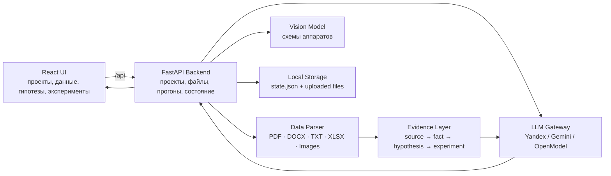

# NORLAB · Фабрика гипотез

Интеллектуальная R&D-система для генерации, обоснования и проверки научно-технических гипотез по данным лаборатории: отчётам, таблицам экспериментов, патентам, статьям и схемам оборудования.

Проект сфокусирован на металлургии и обогащении: отвальные хвосты, шлаки, извлечение Ni/Cu/PGM и проверяемые технологические улучшения без промышленного синтеза.

---

## Что делает система

NORLAB помогает исследователю пройти путь от сырого набора документов до проверяемого плана эксперимента:

1. пользователь создаёт проект и формулирует инженерную задачу;
2. загружает PDF/DOCX/TXT/XLSX/изображения схем;
3. backend извлекает факты, параметры, baseline, KPI и ограничения;
4. LLM-оркестратор генерирует гипотезы с числовыми условиями и физико-химическим механизмом;
5. система дедуплицирует, фильтрует и критикует гипотезы;
6. финальные варианты связываются с источниками и превращаются в roadmap эксперимента.

---

## Архитектура



### Основные блоки

| Блок | Роль |
| --- | --- |
| Frontend | Веб-интерфейс для постановки задачи, загрузки данных, запуска исследования, просмотра гипотез и экспериментов. |
| Backend API | Управляет проектами, файлами, прогонами, гипотезами, экспериментами и экспортом. |
| Data Parser | Достаёт факты и параметры из документов, таблиц и схем. |
| LLM Gateway | Единая точка подключения моделей для генерации, критики, JSON-repair и vision-задач. |
| Evidence Layer | Сохраняет трассировку: файл, страница, абзац, факт, гипотеза, эксперимент. |
| Experiment Builder | Превращает выбранную гипотезу в проверяемый лабораторный протокол. |

---

## Почему решение быстрое и точное

Система не отправляет в модель весь массив документов целиком. Сначала backend извлекает компактный evidence pack: baseline, KPI, параметры опытов, ограничения и признаки качества данных. Поэтому LLM получает уже подготовленный научно-инженерный контекст.

Точность повышается за счёт многоступенчатого пайплайна:

- предметная область жёстко ограничена хвостами, шлаками, обогащением и металлургическим переделом;
- каждая гипотеза должна иметь числовой критерий проверки;
- требуется физико-химический механизм, а не общая идея;
- гипотеза связывается с источниками;
- повторы удаляются дедупликацией;
- критик оценивает научность, реализуемость, механизм и проверяемость;
- для финалистов автоматически формируется план эксперимента.

---

## Быстрый старт через Docker

### 1. Требования

- Docker Desktop или Docker Engine;
- Docker Compose v2;
- доступ к LLM API, если нужна реальная генерация гипотез.

### 2. Клонирование

```bash
git clone https://github.com/Yujir0k/NN_hyp.git
cd NN_hyp
```

### 3. Настройка переменных окружения

```bash
cp .env.example .env
```

Заполните в `.env` ключи провайдера. Для текущей рабочей конфигурации используется Yandex:

```env
YANDEX_API_KEY=
YANDEX_FOLDER_ID=
NORLAB_LLM_PROVIDER=yandex
NORLAB_GENERATOR_MODEL=gpt-oss-120b
NORLAB_FAST_MODEL=gpt-oss-120b
NORLAB_CRITIC_MODEL=gpt-oss-120b
NORLAB_VISION_MODEL=qwen3.6-35b-a3b
NORLAB_LLM_MODE=real
```

Если ключи не указаны, интерфейс и API поднимутся, но реальные LLM-прогоны не смогут полноценно генерировать гипотезы.

### 4. Запуск

```bash
docker compose up --build
```

Откройте:

```text
http://localhost:4173
```

Проверка backend:

```bash
curl http://localhost:4173/api/health
```

Ожидаемый ответ содержит:

```json
{
  "status": "ok"
}
```

### 5. Остановка

```bash
docker compose down
```

Полная очистка локального состояния Docker:

```bash
docker compose down -v
```

---

## Локальный запуск без Docker

Backend:

```bash
python -m pip install -e .
python -m uvicorn app.main:app --host 127.0.0.1 --port 8000
```

Frontend:

```bash
cd frontend
npm ci
npm run dev -- --host 127.0.0.1 --port 4173
```

Откройте:

```text
http://127.0.0.1:4173
```

---

## Проверки качества

Backend:

```bash
python -m pytest
```

Frontend:

```bash
cd frontend
npm run lint
npm test -- --run
npm run build
```

Docker smoke-check:

```bash
docker compose up --build -d
curl http://localhost:4173/api/health
curl http://localhost:4173/api/projects
docker compose down
```

---

## Структура репозитория

```text
.
├── app/                    # FastAPI backend и LLM pipeline
├── data/
│   ├── state/              # локальное состояние backend
│   └── storage/            # загруженные файлы
├── frontend/               # React + TypeScript UI
├── infra/                  # SQL/Cypher заготовки для расширенной инфраструктуры
├── scripts/                # локальный старт и smoke-test
├── tests/                  # backend tests
├── Dockerfile              # backend container
├── docker-compose.yml      # frontend + backend
├── .env.example            # пример конфигурации
└── README.md
```

---

## Ключевые пользовательские сценарии

### Создание проекта

Пользователь задаёт исследовательскую задачу обычным инженерным текстом: проблема, ожидаемый результат, критерий успеха и ограничения. Это ближе к реальному R&D-ТЗ, чем набор жёстких переключателей.

### Загрузка источников

Поддерживаются документы, таблицы и изображения схем оборудования. Система сохраняет исходники и строит трассировку от файла до факта и гипотезы.

### Исследовательский прогон

Пайплайн проходит этапы памяти, генерации, дедупликации, gates, критики и финального отбора. Пользователь видит статус, время и воронку кандидатов.

### Портфель гипотез

Каждая гипотеза показывает главную идею, проверяемую формулировку, KPI, экономический эффект, механизм, риски, новизну, ключевое условие и источники.

### Эксперименты

Для выбранной гипотезы формируется план проверки: цель, параметры, roadmap, длительность, критерии успеха и ожидаемый результат.

---

## Технологии

- Python 3.13
- FastAPI
- Pydantic
- httpx
- OpenPyXL
- pypdf
- React 19
- TypeScript
- Vite
- React Query
- nginx
- Docker Compose

---

## Безопасность

Не коммитьте реальные ключи API. Для локального запуска используйте `.env`, он игнорируется git.

В репозитории должен находиться только `.env.example` с пустыми значениями.
