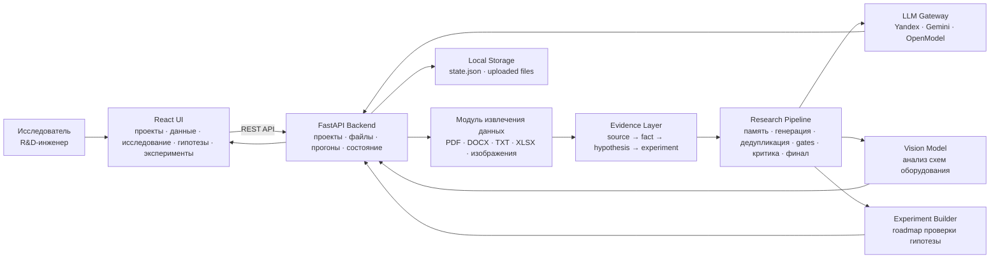

# NORLAB · Фабрика гипотез

> Интеллектуальная R&D-система, которая превращает лабораторные документы, таблицы экспериментов и схемы оборудования в проверяемые научно-технические гипотезы и планы экспериментов.

NORLAB помогает исследователю не просто «получить идеи от LLM», а пройти полный инженерный цикл: поставить технологическую проблему, загрузить источники, извлечь факты, сгенерировать гипотезы с числовыми условиями, проверить их на ограничения, отранжировать и подготовить дорожную карту лабораторной проверки.

Проект сфокусирован на металлургии и обогащении: отвальные хвосты, шлаки, Ni/Cu/PGM, флотация, измельчение, реагентные режимы и металлургический передел. Промышленный синтез намеренно исключён из предметной области.

---

## Коротко о продукте

Исследователь загружает в систему PDF, DOCX, TXT, XLSX и изображения схем оборудования. Backend извлекает из них evidence pack: baseline, KPI, параметры опытов, ограничения, факты из источников и признаки качества данных. Затем LLM-пайплайн генерирует до 12 проверяемых гипотез, удаляет повторы, пропускает кандидатов через gates, оценивает их критиком и формирует финальный портфель.

Каждая финальная гипотеза показывает:

- конкретную проверяемую формулировку;
- числовые условия проверки;
- ожидаемый KPI и экономический эффект;
- физико-химический механизм;
- риски, новизну и неопределённость;
- связь с источниками;
- план первого эксперимента.

Цель интерфейса — дать R&D-инженеру понятный рабочий инструмент, а не демонстрационную заглушку. Поэтому важные элементы системы сделаны трассируемыми: от файла и факта до гипотезы, эксперимента и риска.

---

## Архитектура для презентации



### Основные блоки

| Блок | Что делает | Зачем нужен |
| --- | --- | --- |
| **React UI** | Даёт интерфейс для проектов, brief, источников, прогонов, гипотез и экспериментов. | Пользователь видит весь исследовательский цикл в одном месте. |
| **FastAPI Backend** | Управляет проектами, файлами, прогонами, гипотезами, экспериментами и экспортом. | Отделяет бизнес-логику от интерфейса и готовит систему к интеграции. |
| **Data Parser** | Читает PDF/DOCX/TXT/XLSX и изображения схем. | Превращает разнородные источники в структурированные факты. |
| **Evidence Layer** | Хранит связи между файлом, страницей, абзацем, фактом, гипотезой и экспериментом. | Позволяет объяснить, почему система предложила именно эту гипотезу. |
| **LLM Gateway** | Единая точка подключения моделей генерации, критики, repair и vision-задач. | Можно переключать провайдеров без переписывания frontend и pipeline. |
| **Research Pipeline** | Генерирует, дедуплицирует, фильтрует, оценивает и финализирует гипотезы. | Убирает случайность одиночного LLM-ответа и делает результат проверяемым. |
| **Experiment Builder** | Формирует план проверки гипотезы. | Переводит идею в лабораторное действие. |

---

## Как устроен исследовательский пайплайн

### 1. Создание проекта

Пользователь формулирует задачу обычным инженерным текстом: что нужно улучшить, какой результат ожидается, какие ограничения нельзя нарушать. Это важно, потому что в реальной лаборатории проблема редко выглядит как набор переключателей.

Пример задачи:

> Повысить извлечение ценных компонентов из хвостов флотации. Критерий успеха — прирост извлечения не менее 2 п.п. Ограничить рост расхода реагента 5% и обязательно объяснять физико-химический механизм.

### 2. Загрузка источников

Система принимает:

- PDF-отчёты;
- DOCX-документы;
- TXT-заметки;
- XLSX-таблицы с историей опытов;
- PNG/JPG со схемами аппаратов и технологических цепочек.

Файлы сохраняются в storage, а preview доступен прямо в интерфейсе. Для документов не используется «сырой» вывод бинарного содержимого: DOCX читается корректно через парсинг, а не как plain text.

### 3. Извлечение фактов и evidence pack

Backend не отправляет в LLM весь массив данных целиком. Сначала он извлекает компактный evidence pack:

- baseline и текущие показатели;
- целевые KPI;
- параметры опытов;
- ограничения;
- признаки качества данных;
- факты из документов и таблиц;
- связи со страницами и абзацами источников.

Такой подход ускоряет генерацию и снижает риск «водянистых» гипотез.

### 4. Генерация гипотез

LLM получает подготовленный научно-инженерный контекст и генерирует проверяемые гипотезы. От гипотезы требуется не просто идея, а структура:

- что меняем;
- в каком диапазоне;
- какой KPI должен измениться;
- почему это должно сработать;
- чем это подтверждается;
- какой первый тест нужен.

### 5. Дедупликация и gates

Система удаляет повторы и пропускает кандидатов через набор проверок:

- соответствует ли гипотеза предметной области;
- есть ли числовое условие;
- есть ли проверяемый KPI;
- не нарушены ли ограничения;
- можно ли проверить гипотезу экспериментально;
- есть ли хотя бы минимальная evidence-трассировка.

### 6. Критика и ранжирование

Критик оценивает гипотезы по нескольким измерениям:

- научная обоснованность;
- понятность механизма;
- инженерная реализуемость;
- проверяемость;
- риск;
- новизна;
- потенциальный эффект.

В финал попадают не обязательно все кандидаты. Если часть гипотез отсеивается, система показывает причины отсева.

### 7. План эксперимента

Для выбранной гипотезы формируется план проверки: цель, параметры, длительность, порядок действий, контрольный baseline и критерий успеха. Это делает результат пригодным для лабораторного обсуждения, а не только для презентации.

---

## Почему решение работает быстро и точно

NORLAB ускоряет исследовательский цикл за счёт того, что LLM не работает «вслепую». Перед генерацией backend готовит короткий, насыщенный фактами контекст. Поэтому модель не тратит время на чтение всего массива документов и меньше склонна уходить в общие рассуждения.

Точность повышается за счёт нескольких принципов:

- **узкая предметная область** — хвосты, шлаки, флотация, измельчение, реагенты, металлургический передел;
- **обязательные числа** — гипотеза должна содержать диапазоны, проценты, p.p., P80, время, расход или другой проверяемый параметр;
- **физико-химический механизм** — система объясняет, почему изменение должно повлиять на извлечение;
- **evidence-трассировка** — гипотеза связывается с источниками и фактами;
- **многоступенчатый отбор** — генерация, дедупликация, gates, критика и финал;
- **готовность к мультимодальности** — схемы оборудования обрабатываются через vision-модель;
- **fallback по провайдерам** — архитектура допускает переключение между Yandex, Gemini и OpenModel.

---

## Что видит пользователь

| Экран | Назначение |
| --- | --- |
| **Проекты** | Список исследовательских проектов и создание нового brief. |
| **Рабочая область** | Источники, brief, данные проекта и базовая готовность. |
| **Данные** | Список файлов, preview, информация об источнике и удаление файла. |
| **Исследование** | Статус pipeline, elapsed/ETA, воронка гипотез и список кандидатов. |
| **Гипотезы** | Финальный портфель, фильтрация, сравнение, карточки и детальные модальные окна. |
| **Эксперименты** | План проверки выбранной гипотезы и протокол эксперимента. |

---

## Технологический стек

### Frontend

- React 19;
- TypeScript;
- Vite;
- React Query;
- CSS modules/native CSS;
- nginx для production-раздачи.

### Backend

- Python 3.13;
- FastAPI;
- Pydantic;
- httpx;
- openpyxl;
- pypdf;
- python-multipart;
- локальное state/storage-хранилище.

### LLM и модели

Текущая рабочая конфигурация ориентирована на Yandex Cloud:

- генерация: `gpt-oss-120b`;
- быстрые проверки/repair: `gpt-oss-120b`;
- критика: `gpt-oss-120b`;
- анализ изображений: `qwen3.6-35b-a3b`;
- embeddings: `yandex-embeddings`.

Архитектурно backend также содержит gateway для Gemini и OpenModel.

---

## Быстрый старт через Docker

### 1. Требования

- Docker Desktop или Docker Engine;
- Docker Compose v2;
- доступ к LLM API, если нужна реальная генерация гипотез.

### 2. Клонирование

```bash
git clone https://github.com/Yujir0k/NN_hyp.git
cd NN_hyp
```

### 3. Настройка окружения

```bash
cp .env.example .env
```

Заполните `.env`:

```env
YANDEX_API_KEY=
YANDEX_FOLDER_ID=
NORLAB_LLM_PROVIDER=yandex
NORLAB_GENERATOR_MODEL=gpt-oss-120b
NORLAB_FAST_MODEL=gpt-oss-120b
NORLAB_CRITIC_MODEL=gpt-oss-120b
NORLAB_VISION_MODEL=qwen3.6-35b-a3b
NORLAB_LLM_MODE=real
```

Если ключи не указаны, frontend и backend поднимутся, но реальные LLM-прогоны не смогут полноценно генерировать гипотезы.

### 4. Запуск

```bash
docker compose up --build
```

Откройте:

```text
http://localhost:4173
```

Проверка backend:

```bash
curl http://localhost:4173/api/health
```

Ожидаемый ответ:

```json
{
  "status": "ok"
}
```

### 5. Остановка

```bash
docker compose down
```

Полная очистка локального состояния:

```bash
docker compose down -v
```

---

## Локальный запуск без Docker

Backend:

```bash
python -m pip install -e .
python -m uvicorn app.main:app --host 127.0.0.1 --port 8000
```

Frontend:

```bash
cd frontend
npm ci
npm run dev -- --host 127.0.0.1 --port 4173
```

Откройте:

```text
http://127.0.0.1:4173
```

---

## Проверки качества

Backend:

```bash
python -m pytest
```

Frontend:

```bash
cd frontend
npm run lint
npm test -- --run
npm run build
```

Docker smoke-check:

```bash
docker compose up --build -d
curl http://localhost:4173/api/health
curl http://localhost:4173/api/projects
docker compose down
```

---

## Структура репозитория

```text
.
├── app/                    # FastAPI backend и LLM pipeline
├── data/
│   ├── state/              # локальное состояние backend
│   └── storage/            # загруженные файлы
├── frontend/               # React + TypeScript UI
├── infra/                  # SQL/Cypher заготовки для расширенной инфраструктуры
├── scripts/                # локальный старт и smoke-test
├── tests/                  # backend tests
├── Dockerfile              # backend container
├── docker-compose.yml      # frontend + backend
├── .env.example            # пример конфигурации
└── README.md
```
